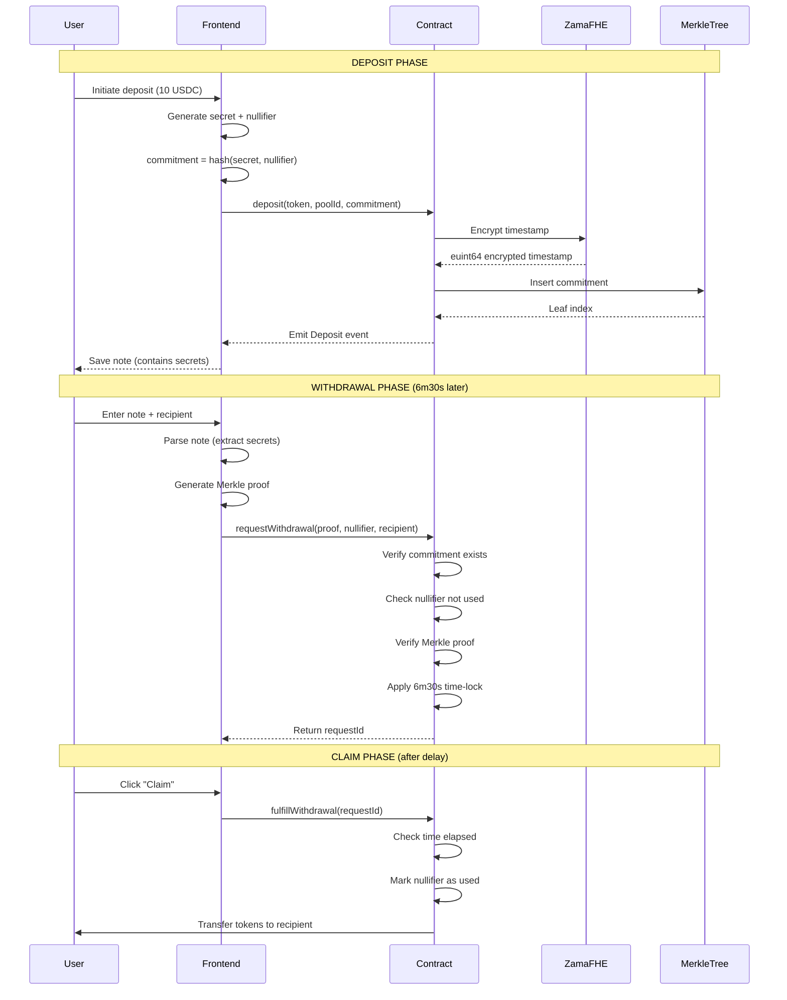

# Silence

> Privacy-preserving cryptocurrency protocol powered by Fully Homomorphic Encryption (FHE)

Silence is a next-generation privacy protocol that enables anonymous cryptocurrency transactions using Zama's FHEVM technology. Break the on-chain link between deposits and withdrawals while maintaining provable security.

---

## Table of Contents

- [Overview](#overview)
- [How It Works](#how-it-works)
- [Why FHE?](#why-fhe)
- [Architecture](#architecture)
- [Features](#features)
- [Getting Started](#getting-started)
- [Usage Guide](#usage-guide)
- [Security Model](#security-model)
- [Technical Details](#technical-details)
- [Roadmap](#roadmap)

---

## Overview

Silence breaks the on-chain link between deposits and withdrawals, providing transaction privacy on public blockchains. Unlike traditional privacy protocols, Silence leverages **Fully Homomorphic Encryption (FHE)** to add an additional layer of privacy on deposit timestamps.

### Key Privacy Features

- **Zero-Knowledge Proofs**: Prove ownership without revealing which deposit
- **Encrypted Timestamps**: Deposit times hidden via Zama's FHE
- **Time-Delayed Withdrawals**: Prevent timing analysis attacks
- **Anonymity Sets**: Pool deposits for enhanced privacy
- **Multi-Token Support**: Support for various ERC-20 tokens

---

## How It Works

### High-Level Flow
```
┌─────────────┐          ┌──────────────┐          ┌─────────────┐
│   Deposit   │          │   Silence    │          │  Withdraw   │
│   (Public)  │──────────│   Contract   │──────────│  (Private)  │
└─────────────┘          └──────────────┘          └─────────────┘
      │                         │                          │
      │ 1. Deposit + Generate   │                          │
      │    Note (Secret)        │                          │
      │─────────────────────────>                          │
      │                         │                          │
      │ 2. Commitment stored    │                          │
      │    (Merkle Tree)        │                          │
      │<────────────────────────│                          │
      │                         │                          │
      │                         │ 3. Request Withdrawal    │
      │                         │    (ZK Proof + Note)     │
      │                         │<─────────────────────────│
      │                         │                          │
      │                         │ 4. Verify & Time-Lock    │
      │                         │    (6m30s delay)         │
      │                         │                          │
      │                         │ 5. Fulfill Withdrawal    │
      │                         │    (After delay)         │
      │                         │──────────────────────────>
```

### Detailed Step-by-Step

#### 1. Deposit Phase
```
User generates:
├── Secret (random 256 bits)
├── Nullifier (random 256 bits)
└── Commitment = hash(secret, nullifier)

┌──────────────────────────────────────────┐
│  User deposits 10 USDC + commitment      │
│  Smart Contract:                         │
│  ├── Stores commitment in Merkle tree    │
│  ├── Encrypts timestamp with FHE         │  ← Zama FHEVM
│  └── Returns note with secrets           │
└──────────────────────────────────────────┘

Note format: silence-base64(json({
  secret, nullifier, amount, token, poolId, chainId
}))
```

#### 2. Anonymity Set Growth
```
Merkle Tree (Pool Size: 10 USDC)
         ROOT
        /    \
       /      \
      •        •
     / \      / \
    •   •    •   •
   /|   |\  /|   |\
  • •   • •• •   • •  ← Your deposit is one of these
  
Larger anonymity set = Better privacy
```

#### 3. Withdrawal Phase
```
User provides:
├── Note (contains secrets)
├── Merkle Proof (proves deposit exists)
└── Nullifier (prevents double-spending)

┌──────────────────────────────────────────┐
│  Smart Contract verifies:               │
│  ├── Commitment exists in tree          │
│  ├── Nullifier not used before          │
│  ├── Merkle proof is valid              │
│  └── hash(secret, nullifier) matches    │
└──────────────────────────────────────────┘

6m30s time-lock delay
(prevents timing correlation)

Withdrawal fulfilled to new address
```

---

## Why FHE? (Fully Homomorphic Encryption)

Traditional privacy protocols can be vulnerable to **timing analysis attacks**. Even with pooled deposits, analyzing deposit and withdrawal times can reveal links.

### The Problem: Timing Analysis
```
Traditional Protocol:
Deposit:   [User A: 10:00] [User B: 10:05] [User C: 10:10]
Withdraw:  [Addr X: 10:15] [Addr Y: 10:20] [Addr Z: 10:25]
           
Pattern: User A → Addr X (15min gap)
Pattern: User B → Addr Y (15min gap)
```

### Silence Solution: FHE-Encrypted Timestamps
```
With Zama FHEVM:
Deposit:   [User A: encrypted] [User B: encrypted] [User C: encrypted]
           
Timestamps are ENCRYPTED on-chain
Cannot be read or analyzed
Can still be compared homomorphically (future feature)
```

### What is FHE?

**Fully Homomorphic Encryption** allows computations on encrypted data without decryption.
```
Normal Encryption:
encrypt(5) + encrypt(3) = encrypted_gibberish

FHE:
encrypt(5) + encrypt(3) = encrypt(8)
         │
         └─> Can perform operations on encrypted data
```

### Zama's FHEVM Integration
```solidity
// Store encrypted timestamp on deposit
euint64 encryptedTimestamp = TFHE.asEuint64(block.timestamp);
commitmentMetadata[commitment] = CommitmentMetadata({
    encryptedTimestamp: encryptedTimestamp,
    amount: denomination,
    exists: true
});
```

**Future capabilities:**
- Enforce minimum time between deposit/withdrawal (encrypted)
- Compute average wait times (without revealing individual times)
- Advanced privacy features impossible with regular encryption

---

## Architecture

### Smart Contract Architecture
```
┌─────────────────────────────────────────────────────────┐
│                    Silence.sol                          │
├─────────────────────────────────────────────────────────┤
│                                                         │
│  Pool Management                                        │
│  ├── createPool(token, denomination)                   │
│  ├── togglePool(token, poolId)                         │
│  └── Multi-pool support (1, 10, 100, 1000 tokens)      │
│                                                         │
│  Deposits                                               │
│  ├── deposit(token, poolId, commitment)                │
│  ├── Merkle tree insertion                             │
│  └── FHE timestamp encryption via Zama                 │
│                                                         │
│  Withdrawals                                            │
│  ├── requestWithdrawal(proof, nullifier, recipient)    │
│  ├── Time-lock mechanism (6m30s default)               │
│  ├── fulfillWithdrawal(requestId)                      │
│  └── Nullifier tracking (prevent double-spend)         │
│                                                         │
│  Privacy Features                                       │
│  ├── Merkle tree for commitment proofs                 │
│  ├── Nullifier set for spent notes                     │
│  └── Encrypted metadata via TFHE library               │
│                                                         │
└─────────────────────────────────────────────────────────┘
```

### Frontend Architecture
```
┌─────────────────────────────────────────────────────────┐
│                  Next.js 15 Frontend                    │
├─────────────────────────────────────────────────────────┤
│                                                         │
│  Pages & Components                                     │
│  ├── /silence - Main privacy interface                 │
│  ├── Deposit flow with note generation                 │
│  ├── Withdrawal flow with note validation              │
│  └── Pending withdrawals drawer                        │
│                                                         │
│  State Management                                       │
│  ├── Zustand stores (withdrawal, drawer)               │
│  ├── LocalStorage for pending withdrawals              │
│  └── React hooks for contract interaction              │
│                                                         │
│  Web3 Integration                                       │
│  ├── Wagmi v2 for wallet connections                   │
│  ├── Viem for contract interactions                    │
│  └── RainbowKit for wallet UI                          │
│                                                         │
│  Crypto Operations (Client-side)                       │
│  ├── Note generation (secret + nullifier)              │
│  ├── Commitment calculation (hash)                     │
│  ├── Merkle proof generation                           │
│  └── Base64 encoding for note strings                  │
│                                                         │
└─────────────────────────────────────────────────────────┘
```

### Privacy Flow Diagram


---

## Features

### Core Privacy Features

- **Zero-Knowledge Withdrawals**: Withdraw without revealing deposit
- **FHE Timestamp Protection**: Deposit times encrypted via Zama
- **Merkle Tree Proofs**: Efficient proof generation
- **Multi-Pool System**: Separate pools by denomination (1, 10, 100, 1000)
- **Time-Delayed Withdrawals**: 6m30s mandatory wait
- **Multi-Token Support**: USDC, USDT, DAI, and more

### UX Features

- **Note Generation & Download**: Automatic secret creation
- **Withdrawal Manager**: Track pending withdrawals
- **Real-time Status**: Live anonymity set size
- **Recent Deposits Feed**: Monitor pool activity
- **Mobile Responsive**: Full mobile support

### Security Features

- **Nullifier Tracking**: Prevent double-spending
- **Commitment Validation**: Cryptographic proof verification
- **Reentrancy Protection**: OpenZeppelin ReentrancyGuard
- **Access Controls**: Owner-only admin functions

---

## Getting Started

### Prerequisites
```bash
Node.js >= 18
pnpm >= 8
MetaMask or compatible Web3 wallet
```

### Installation
```bash
# Clone repository
git clone https://github.com/yourusername/silence.git
cd silence

# Install dependencies
pnpm install

# Set up environment variables
cp .env.example .env.local
```

### Environment Setup
```bash
# .env.local
NEXT_PUBLIC_SILENCE_ADDRESS=0x...
NEXT_PUBLIC_USDC_ADDRESS=0x...
NEXT_PUBLIC_USDT_ADDRESS=0x...
NEXT_PUBLIC_DAI_ADDRESS=0x...
NEXT_PUBLIC_WALLETCONNECT_PROJECT_ID=your_project_id
```

### Run Development Server
```bash
pnpm dev
# Open http://localhost:3000
```

### Deploy Contract
```bash
# Using Foundry
forge script script/Deploy.s.sol --rpc-url $RPC_URL --broadcast

# Or using Hardhat
npx hardhat run scripts/deploy.ts --network <network-name>
```

---

## Usage Guide

### For Users

#### 1. Deposit Funds
```
1. Connect wallet
2. Select token (USDC, USDT, DAI)
3. Choose amount (1, 10, 100, or 1000)
4. Click "Deposit"
5. SAVE YOUR NOTE (Download or copy)
   WARNING: Without the note, funds are LOST FOREVER
```

#### 2. Wait for Anonymity
```
Monitor the anonymity set size:
- Small set (1-5): LOW privacy
- Medium set (6-20): GOOD privacy
- Large set (20+): EXCELLENT privacy

The longer you wait, the more people deposit
```

#### 3. Withdraw Funds
```
1. Paste your note
2. (Optional) Enter recipient address
   - Leave empty to withdraw to connected wallet
3. Click "Withdraw"
4. Wait 6m30s for time-lock
5. Click "Claim" to receive funds
```

### Note Format
```
silence-eyJzZWNyZXQiOiIweDEyMzQuLi4iLCJudWxsaWZpZXIiOiIw...

Decoded JSON:
{
  "secret": "0x1234...",
  "nullifier": "0x5678...",
  "amount": "10",
  "token": "0xUSDC...",
  "poolId": 1,
  "chainId": 1
}
```

---

## Security Model

### Threat Model

#### Protected Against

- **On-chain Analysis**: Cannot link deposits to withdrawals
- **Timing Attacks**: FHE timestamps + mandatory delay
- **Front-running**: Time-locked withdrawals
- **Double-spending**: Nullifier tracking
- **Pool Draining**: Merkle proof verification

#### Limitations

- **Small Anonymity Sets**: Need multiple users for privacy
- **Network Analysis**: IP addresses (use Tor/VPN)
- **Malicious Relayers**: Always verify contract directly
- **Compromised Frontend**: Verify contract addresses

### Best Practices
```
DO:
- Save your note securely (encrypted, offline)
- Wait for larger anonymity sets
- Use different recipient addresses
- Withdraw to fresh addresses
- Use VPN/Tor for IP privacy

DON'T:
- Share your note with anyone
- Reuse withdrawal addresses
- Withdraw immediately after deposit
- Use the same amounts repeatedly
- Forget to save your note (funds = LOST)
```

---

## Technical Details

### Cryptographic Primitives
```solidity
// Commitment
commitment = keccak256(abi.encodePacked(secret, nullifier))

// Nullifier (prevents double-spend)
nullifier = keccak256(secret)

// Merkle Root (proves inclusion)
root = computeMerkleRoot(commitment, proof)
```

### Merkle Tree Structure
```
Height: 20 levels
Capacity: 2^20 = 1,048,576 deposits per pool
Hash Function: Keccak256

Tree Example (simplified):
         ROOT
        /    \
       H1    H2
      / \    / \
     H3 H4  H5 H6
    /|  |\  /|  |\
   L1 L2 L3 L4 L5 L6  ← Commitments (leaves)
```

### Gas Costs (Estimated)

| Operation | Gas Cost | USD (30 gwei, $2000 ETH) |
|-----------|----------|--------------------------|
| Create Pool | ~150k | ~$9 |
| Deposit | ~180k | ~$10.80 |
| Request Withdrawal | ~220k | ~$13.20 |
| Fulfill Withdrawal | ~100k | ~$6 |

### Smart Contract Stats
```
Contract Size: ~15KB
Solidity Version: 0.8.24
Dependencies:
├── OpenZeppelin Contracts
├── Zama FHEVM (TFHE library)
└── Custom Merkle Tree implementation
```

---

## Roadmap

### Phase 1: Core Protocol [COMPLETED]
- [x] Basic deposit/withdrawal flow
- [x] Merkle tree proofs
- [x] Multi-pool support
- [x] FHE timestamp encryption

### Phase 2: Enhanced Privacy [IN PROGRESS]
- [ ] Advanced FHE features (encrypted time windows)
- [ ] Multi-hop withdrawals
- [ ] Decentralized relayer network
- [ ] Cross-chain support (LayerZero/Wormhole)

---

## Statistics
```
Total Value Locked: $XXX,XXX
Total Deposits: XX,XXX
Unique Users: X,XXX
Average Anonymity Set: XX
Largest Pool: XXX deposits
```

---

## Contributing

We welcome contributions. Please see [CONTRIBUTING.md](CONTRIBUTING.md)
```bash
# Fork the repo
# Create your feature branch
git checkout -b feature/amazing-feature

# Commit your changes
git commit -m 'Add amazing feature'

# Push to the branch
git push origin feature/amazing-feature

# Open a Pull Request
```

---

## License

This project is licensed under the MIT License 

---

## Acknowledgments

- **Zama** - For FHEVM and FHE technology
- **OpenZeppelin** - Secure smart contract libraries
- **Community** - All contributors and users

---

## Disclaimer

Silence is experimental software. Use at your own risk. Always verify contract addresses and save your notes securely. The developers are not responsible for lost funds.
```
┌────────────────────────────────────────────────────────┐
│  CRITICAL: SAVE YOUR NOTE                              │
│                                                        │
│  Your note is the ONLY way to withdraw funds.         │
│  If you lose it, your money is GONE FOREVER.          │
│                                                        │
│  - Download it                                         │
│  - Print it                                            │
│  - Store it encrypted                                  │
│  - Keep it offline                                     │
│                                                        │
│  DO NOT share your note with anyone                    │
└────────────────────────────────────────────────────────┘
```

---

<div align="center">

**Built for Privacy**

</div>
